# Case Study - Migros Courier Tracking (Spring Boot - Java 21)

<p align="center">
    
</p>

### 📖 Information

<ul style="list-style-type:disc">
  <li>This project demonstrates a <b>Spring Boot</b> application for managing courier travel data. It logs courier locations, tracks travel distances, and manages interactions with stores within a specific radius.</li>
  <li>The application incorporates various design patterns including <b>Facade</b>, <b>Builder</b>, and <b>Strategy</b> patterns, and provides endpoints for logging locations, retrieving travel data, and querying total travel distances.</li>
  <li>Logging Courier Locations:
    <ul>
      <li>The application logs a courier's location details (time, latitude, longitude) whenever they enter within a 100-meter radius of a Store.</li>
      <li>Reentries within one minute to the same store are not counted.</li>
    </ul>
  </li>
  <li>Querying Travel Data:
    <ul>
      <li>It provides endpoints to retrieve past travel data of couriers.</li>
      <li>Includes filtering by store name and time range.</li>
    </ul>
  </li>
  <li>Calculating Travel Distances:
    <ul>
      <li>The application can calculate and return the total travel distance covered by a courier.</li>
    </ul>
  </li>
</ul>


### Explore Rest APIs

Endpoints Summary
<table style="width:100%">
  <tr>
      <th>Method</th>
      <th>Url</th>
      <th>Description</th>
      <th>Request Body</th>
      <th>Path Variable</th>
      <th>Response</th>
  </tr>
  <tr>
      <td>POST</td>
      <td>/api/couriers/log-location</td>
      <td>Log courier's location.</td>
      <td>LogCourierLocationRequest</td>
      <td>None</td>
      <td>CustomResponse&lt;String&gt;</td>
  </tr>
  <tr>
      <td>GET</td>
      <td>/api/couriers/travels/{courierId}</td>
      <td>Get past travels of a courier by courier ID.</td>
      <td>None</td>
      <td>courierId (UUID)</td>
      <td>CustomResponse&lt;List&lt;CourierResponse&gt;&gt;</td>
  </tr>
  <tr>
    <td>POST</td>
    <td>/api/couriers/travels/{courierId}</td>
    <td>Get travels of a courier by courier ID, store name, and time range.</td>
    <td>TravelQueryRequest</td>
    <td>courierId (UUID)</td>
    <td>CustomResponse&lt;List&lt;CourierResponse&gt;&gt;</td>
  </tr>
  <tr>
      <td>GET</td>
      <td>/api/couriers/travels/{courierId}/total-distance</td>
      <td>Get total travel distance of a courier by courier ID.</td>
      <td>None</td>
      <td>courierId (UUID)</td>
      <td>CustomResponse&lt;String&gt;</td>
  </tr>
</table>


### Technologies

---
- Java 21
- Spring Boot 3.0
- Restful API
- Mapstruct
- Open Api (Swagger)
- Maven
- Junit5
- Mockito
- Integration Tests
- Docker
- Docker Compose
- CI/CD (Github Actions)
- Postman
- TestContainer
- MySQL

### Postman

```
Import postman collection under postman_collection folder
```


### Prerequisites

#### Define Variable in .env file for product service and user service

```
DATABASE_USERNAME={DATABASE_USERNAME}
DATABASE_PASSWORD={DATABASE_PASSWORD}
```

### Open Api (Swagger)

```
http://localhost:1226/swagger-ui/index.html
```

---
- Maven or Docker
---


### Docker Run
The application can be built and run by the `Docker` engine. The `Dockerfile` has multistage build, so you do not need to build and run separately.

Please follow directions shown below in order to build and run the application with Docker Compose file;

```sh
$ cd migroscouriertracking
$ docker-compose up -d
```

If you change anything in the project and run it on Docker, you can also use this command shown below

```sh
$ cd migroscouriertracking
$ docker-compose up --build
```

---
### Maven Run
To build and run the application with `Maven`, please follow the directions shown below;

```sh
$ cd migroscouriertracking
$ mvn clean install
$ mvn spring-boot:run
```

---
### Docker Image Location

```
https://hub.docker.com/repository/docker/noyandocker/migroscouriertracking/general
```

### Screenshots

<details>
<summary>Click here to show the screenshots of project</summary>
    <p> Figure 1 </p>
    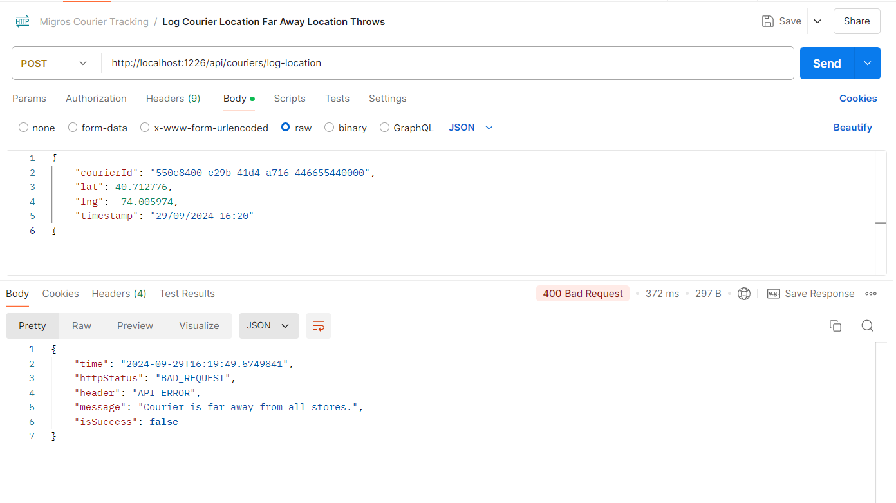
    <p> Figure 2 </p>
    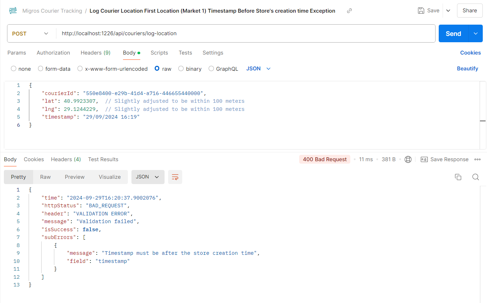
    <p> Figure 3 </p>
    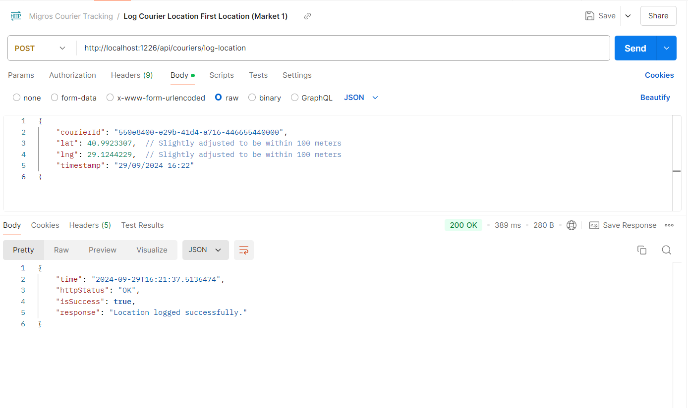
    <p> Figure 4 </p>
    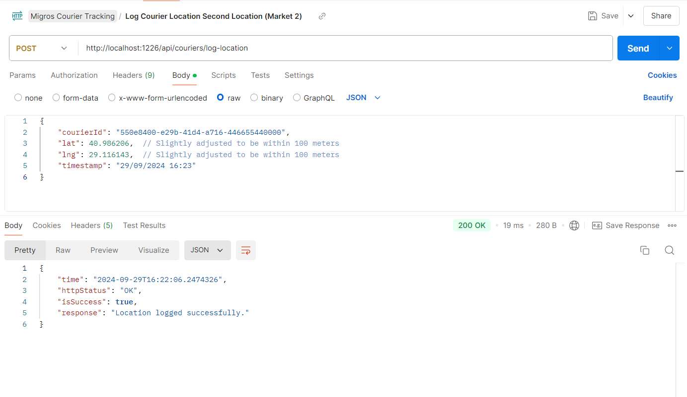
    <p> Figure 5 </p>
    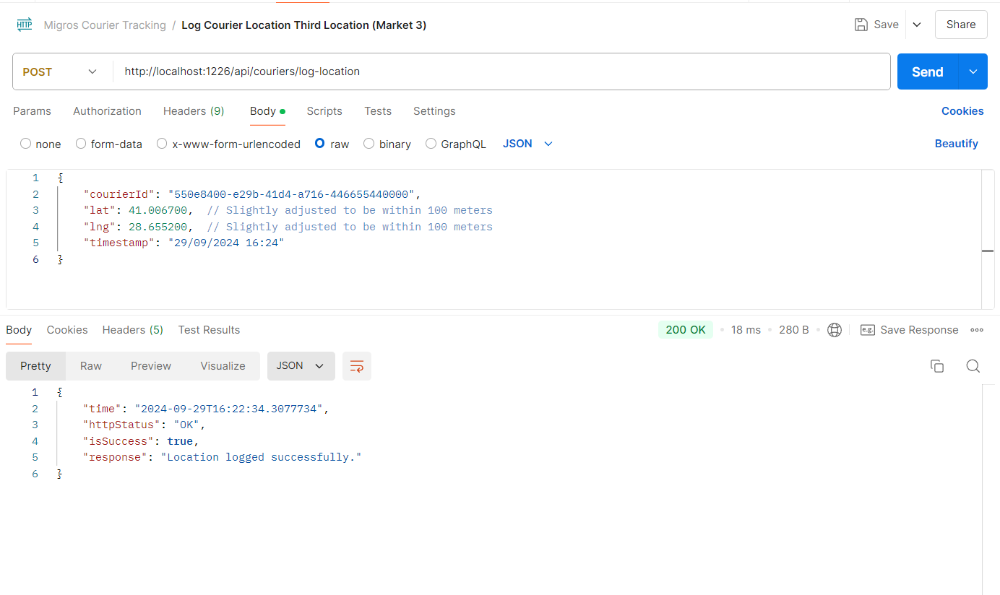
    <p> Figure 6 </p>
    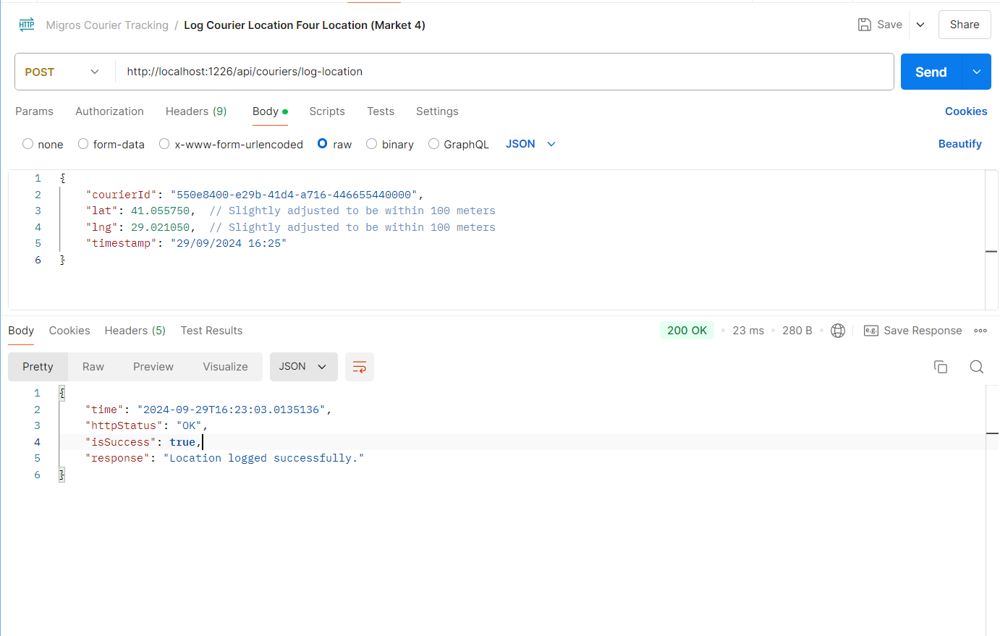
    <p> Figure 7 </p>
    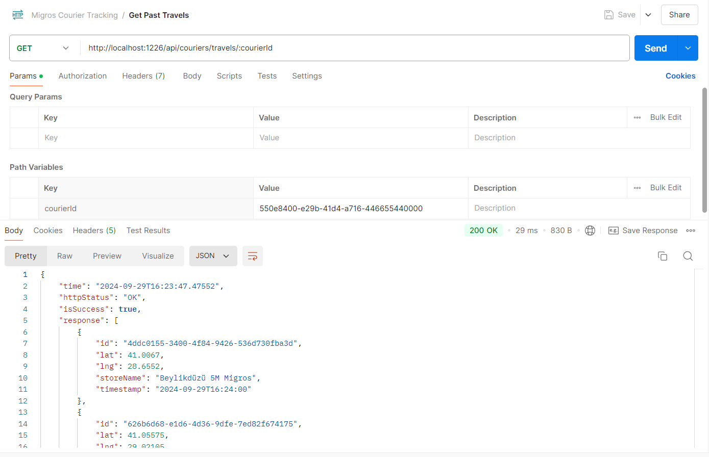
    <p> Figure 8 </p>
    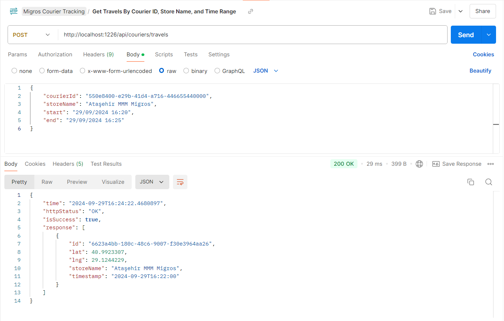
    <p> Figure 9 </p>
    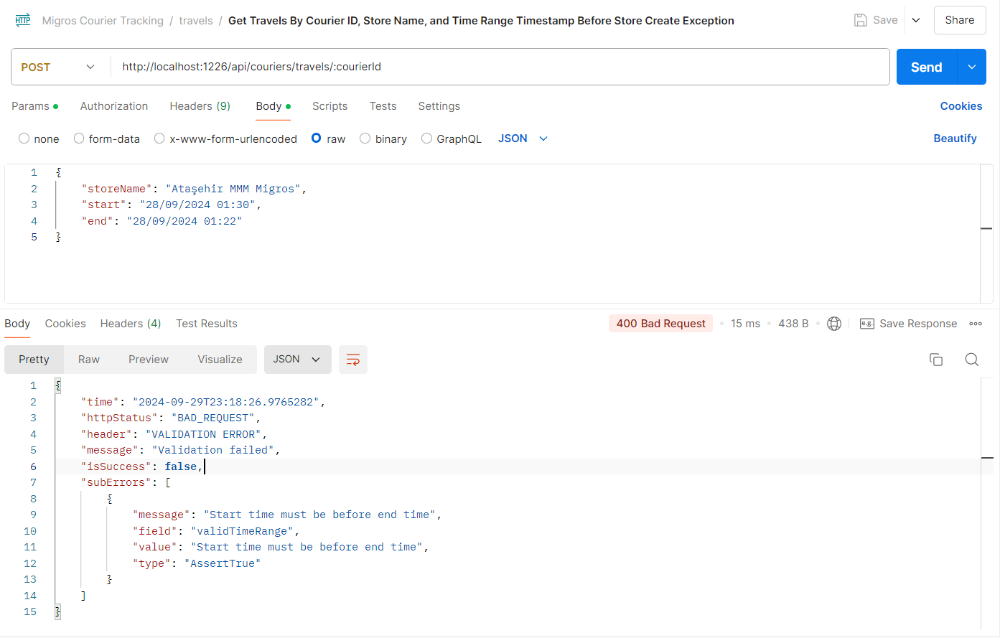
    <p> Figure 10 </p>
    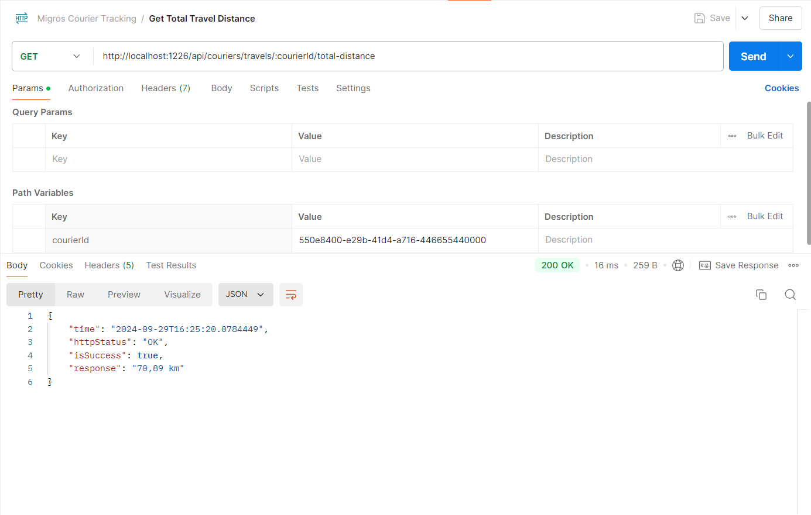
    <p> Figure 11 </p>
    
    <p> Figure 12 </p>
    
    <p> Figure 13 </p>
    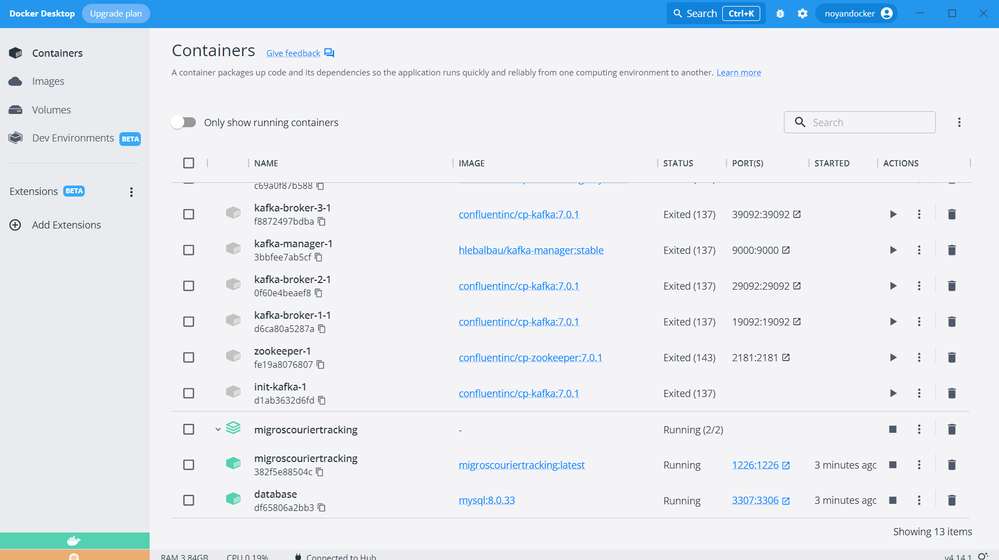
</details>


### Contributors

- [Sercan Noyan Germiyanoğlu](https://github.com/Rapter1990)